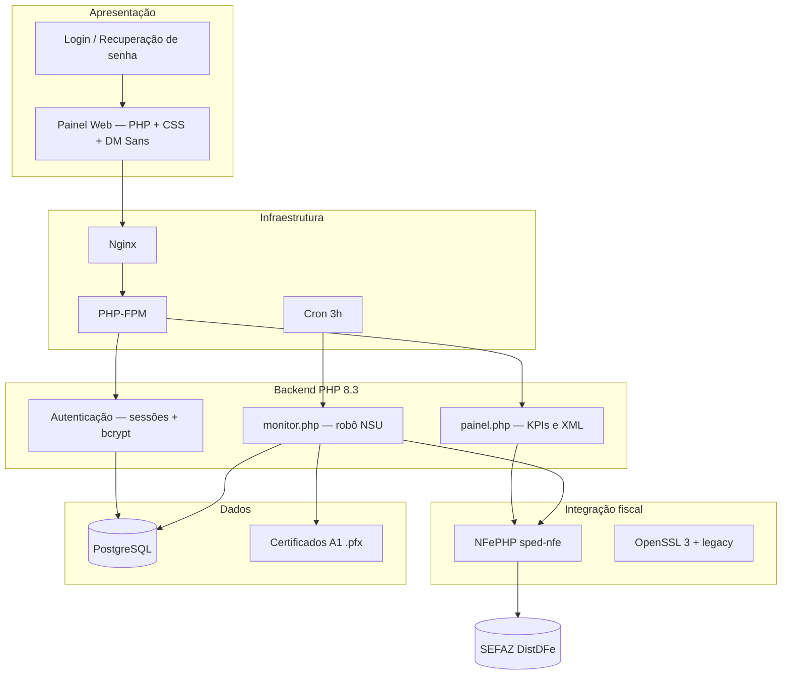
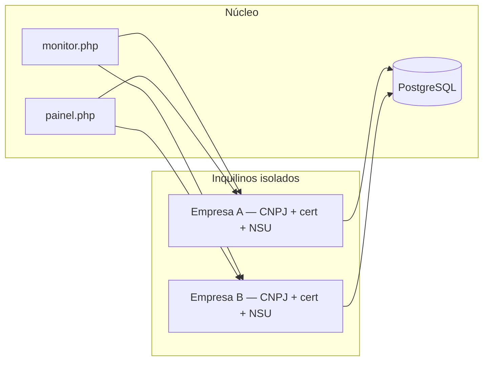
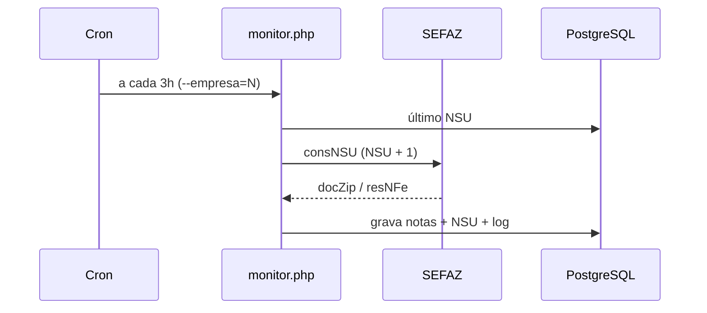

# NFe Monitor

[](https://www.php.net/)
[](https://www.postgresql.org/)
[](https://nginx.org/)
[](https://github.com/nfephp-org/sped-nfe)
[](LICENSE)

**Plataforma multi-empresa para monitoramento automático de NF-e** integrada ao webservice **DistDFe** da SEFAZ — painel web, autenticação por empresa, certificado digital A1 e persistência em PostgreSQL.

> Projeto full-stack em **produção** (VPS Linux + Nginx + cron), desenvolvido para substituir soluções comerciais caras por CNPJ e evoluir como **produto SaaS** com acesso controlado.

---

## Pré-visualização

| Login | Painel |
|-------|--------|
|  |  |

---

## Por que este projeto existe?

Empresas que recebem NF-e precisam **baixar, rastrear e arquivar XMLs** disponibilizados pela SEFAZ. Ferramentas comerciais costumam cobrar **R$ 1.500+/mês por CNPJ**, o que inviabiliza operações com vários CNPJs.

O **NFe Monitor** resolve isso com software próprio em VPS (~R$ 50/mês para N empresas), evoluindo para produto comercial com:

| Problema de negócio | Solução técnica |
|---------------------|-----------------|
| Custo alto por CNPJ | Robô único na VPS atendendo N empresas |
| Múltiplas empresas no mesmo sistema | Isolamento por `empresa_id` (multi-tenant) |
| Bloqueio SEFAZ (erro 656) | Intervalo de 3h + NSU incremental |
| Onboarding de clientes | Upload de certificado `.pfx` pelo painel |
| Acesso comercial | Login fechado — usuários criados pelo admin |
| Credenciais sensíveis | `app_key` + arquivos `.local` fora do Git |
| Certificados legados (OpenSSL 3) | Provider legacy + scripts de deploy |

---

## Stack e arquitetura



| Camada | Tecnologia | O que faz |
|--------|------------|-----------|
| **Backend** | PHP 8.3, Composer | Regras de negócio, robô, autenticação |
| **Fiscal** | NFePHP | SOAP com webservice SEFAZ DistDFe |
| **Banco** | PostgreSQL 14+ | Multi-tenant, notas, logs, NSU |
| **Frontend** | PHP server-side + CSS | Login e dashboard responsivos |
| **Infra** | Nginx, PHP-FPM, Cron | Servidor web e agendamento |
| **Segurança** | AES-256-CBC, bcrypt, `.gitignore` | Criptografia e segredos fora do repo |
| **DevOps** | Bash, PowerShell, SCP | Deploy e manutenção em VPS |

### Competências demonstradas

- Integração com **API governamental** (SEFAZ / NF-e)
- Arquitetura **multi-tenant** com isolamento por empresa
- **Segurança**: segredos locais, criptografia em repouso, histórico Git sanitizado
- **Operação**: cron, logs, rate limit SEFAZ, OpenSSL legacy
- **Full-stack** sem framework pesado — código direto e legível
- **Produto comercial**: licença, suporte configurável, onboarding por cliente

---

## Multi-empresa



---

## Fluxo automático (cron)



---

## Funcionalidades

- Consulta automática DistDFe (NSU incremental)
- Painel com KPIs, tabela de notas e download de XML
- Manifestação de ciência da operação (`210210`)
- Upload de certificado A1 pelo painel
- Controle de licença e quota de logs por empresa
- Recuperação de senha por e-mail
- Cadastro público desabilitado — acesso só para clientes autorizados

---

## Estrutura do projeto

```
nfe-monitor/
├── monitor.php                 # Robô NSU (CLI + cron)
├── Frontend/nfe/
│   ├── login.php               # Entrada
│   ├── painel.php              # Dashboard
│   └── assets/                 # CSS, JS, imagens da marca
├── includes/                   # auth, empresa, monitor_helpers, database
├── database/                   # Migrações SQL
├── deploy/                     # Nginx e OpenSSL (exemplos)
├── scripts/                    # Cron, deploy, usuários, limpeza Git
└── docs/                       # Segurança e publicação GitHub
```

---

## Instalação rápida

```bash
git clone https://github.com/Jefferson23br/nfe-monitor.git
cd nfe-monitor
composer install --no-dev

cp config.example.php config.local.php
cp database.local.php.example database.local.php
cp app.config.php.example app.config.php
cp deploy/deploy.local.ps1.example deploy/deploy.local.ps1
# Edite os arquivos — nunca commite credenciais reais
```

```bash
createdb nfe_monitor
psql -d nfe_monitor -f database/001_multi_empresa_corrigido.sql

php scripts/criar_usuario.php \
  --email=admin@exemplo.com.br \
  --nome="Administrador" \
  --senha="SenhaForte123" \
  --perfil=admin \
  --empresa=1

bash scripts/instalar-cron.sh
```

---

## Segurança e tornar o repositório público

**Nunca commite:**

| Arquivo | Conteúdo sensível |
|---------|-------------------|
| `config.local.php` | CNPJ, senha do `.pfx` |
| `database.local.php` | Senha PostgreSQL, `app_key` |
| `app.config.php` | URLs, WhatsApp, ajustes do servidor |
| `deploy/deploy.local.ps1` | IP e usuário SSH |
| `certs/*.pfx` | Certificado digital A1 |

**Antes de tornar público no GitHub**, limpe o histórico:

```powershell
.\scripts\publicar-repositorio-limpo.ps1
```

Guia completo: [docs/PUBLICAR-GITHUB.md](docs/PUBLICAR-GITHUB.md) · [docs/SEGURANCA.md](docs/SEGURANCA.md)

**Rotacione** senhas de banco, `app_key`, certificado `.pfx` e usuários do painel após publicar.

---

## Licença

Software **proprietário** — veja [LICENSE](LICENSE).

Código público **apenas para portfólio e avaliação técnica**. Cópia, distribuição, uso comercial ou obras derivadas **sem autorização escrita** são proibidas (Lei 9.609/98 e Lei 9.610/98).

---

## Autor

**Jefferson Luis de Lima**

[](https://github.com/Jefferson23br)
